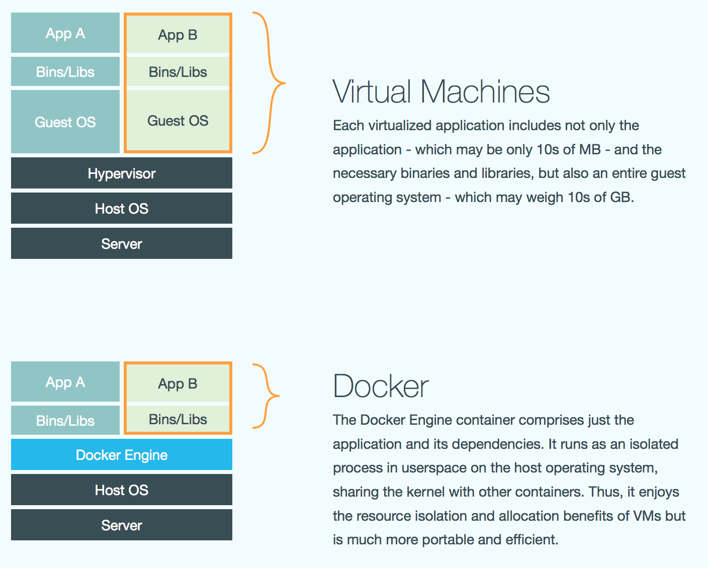
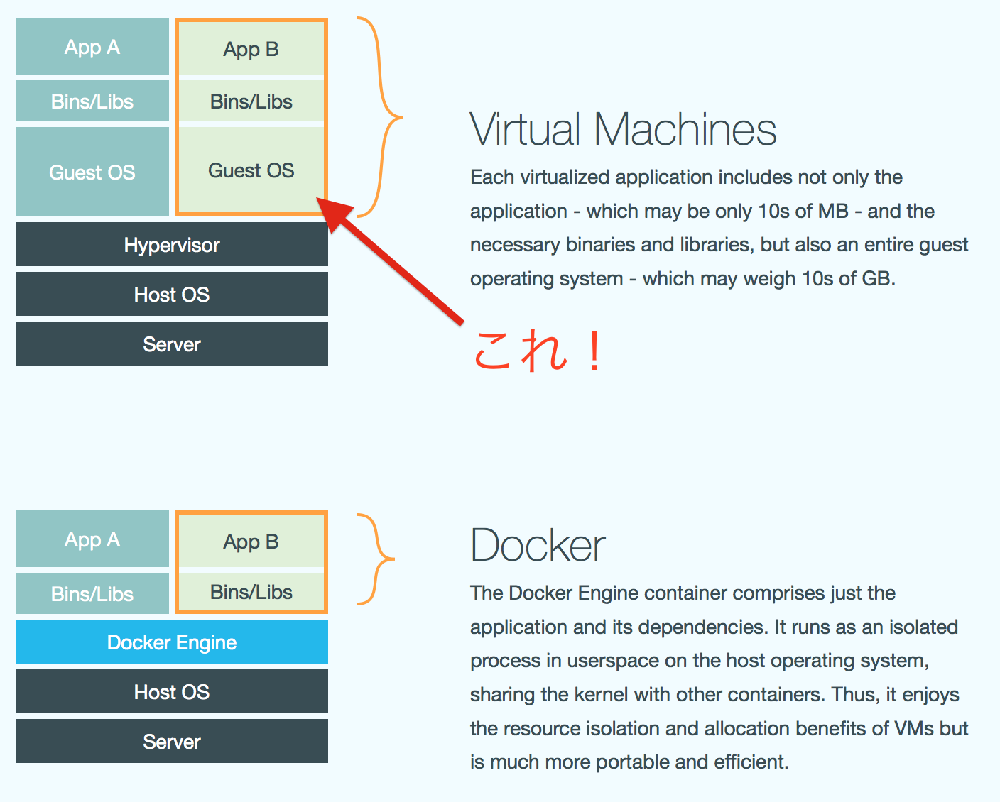
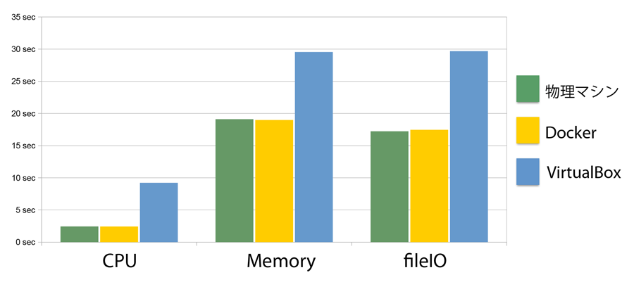
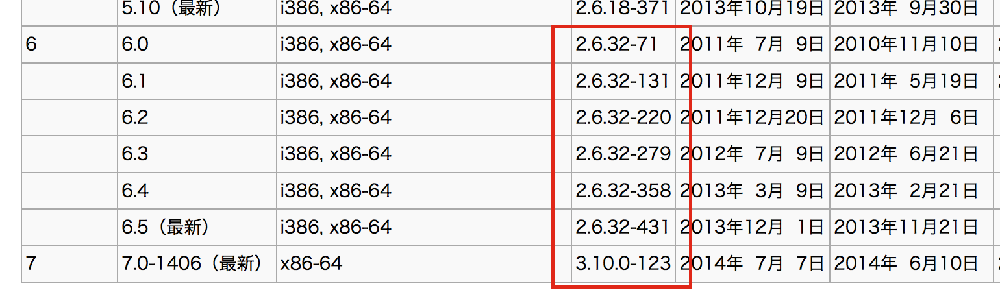

# Docker を使ってみた！
---

# Docker ってなあに？

Docker は Web アプリケーション等を仮想化するための技術の１つです。Linux KVM や VirtualBox といった「ハイパーバイザー型の仮想化」に対して、「コンテナー型の仮想化」と呼ばれています。

---
## Q.ハイパーバイザー型とは何が違うの？

---
## A. ハイパーバイザーの代わりに
## Docker Engine を使用してます。

---
## 図で見るとこんな感じ

---

## ゲストOS のエミュレートは不要！

---

## Docker Engine を利用すると何がうれしいの？

- ハイパーバイザー型の場合はゲストOSをエミュレートして、その上でプロセスが動いているのに対し、Docker Engine は各プロセスをグループで隔離しているだけで、**プロセス自体は直接ホストOS上で動かしている**ためオーバーヘッドが小さい。ようするに少ないリソースで仮想化を実現できる（**超大事**）。
- オーバーヘッドが少ない分、ハイパーバイザー型と比べて起動が比較にならないほど速い！処理も速い！ぶっちゃけ体感では物理サーバで動かしているのと変わらないくらい速い！

---

## Q. 少ないリソースで仮想化実現できるのがそんなにうれしいの？

---

# A. そんなにうれしいです！

---

## 単純にサーバーに負荷がかからないためということだけでなく、クラウド視点からすると「負荷増=コスト増」となるため、負荷はお金と直結しています。負荷が減ってお金減らせたらうれしいじゃん！

---

## Q. 体感で速いとかいわれても分からないよ。実際どれくらい速いのか見える化してよ

---

## A. 速さを比較している表があったので貼付けてみます。
### 軽くて使いやすい仮想化技術 「Docker」の仕組みとエンタープライズ開発における4つの活用事例 
### http://codezine.jp/article/detail/7894

---
##    .

---

## 数値で比較しても物理サーバと違いが見られない！

---

## これはもう仮想化は
# Docker 
## 使うしか無いでしょ

---

# ということで、Docker の仕組み

---
# Docker は既存技術を組み合わせて実現しています。主な技術をご紹介。

- Go言語：Docker は Go 言語で記述されています
- Linux Namespace：名前空間によるプロセス、ネットワークの独立化（この技術でコンテナ化を実現）
- cgroups：リソース(CPU、メモリ、ディスクI/Oなど)の制御
- AUFS：データを差分で管理するファイルシステム（Docker Image を差分で管理するために使用）

---

# 補足_1

- Linux Namespace は Kernel 3.8 以降で実装された比較的新しい技術です（Ubuntuでいうと Version 12.04 くらい）。このため Docker を使用するためにはホストOS 自体の Kernel が 3.8 以降である必要があります。
- Docker 0.8 までは Linux Namespace ではなく LXC
というコンテナ化技術を利用していましたが、0.9 からは Linux Namespace を利用するようになりました。

---

# 補足_2

- AUFS は聞き慣れないファイルシステムかと思いますが、CD Boot で Linuxを起動した際に( KNOPPIX とか)、あたかもファイルを書き換えてるかのように動かせていたのは、CD Boot 時にはこの技術を利用しているためです。

---

# Docker の利用方法

1. Docker をインストール(apt-get や yum)
2. DockerFile を作成
3. Docker run コマンドで Docker Image を作成/起動

※ Docker stopで停止。start で再度起動できます。

---

# [fit] 簡単です。

---

# ただ、注意点が

## 繰り返しますが kernel は 3.8 以上である必要があります。よく使われてそうな CentOS の Kernel Version を調べてみたところ・・・

---

# あ、

---

# ６系全滅だ(3.x ですらない・・)

---

# CentOS を利用する場合は最新の
#  7系をご用意ください

---

# むしろOS選べるのであれば、Docker に特化した軽量な **CoreOS**  をご利用ください

---
## CoreOS について補足_1

##  CoreOS は 2013/8 に α リリースされた、まだ新しい OS ですが 2014/07/25 に安定板がリリースされています。OSS で公開されているため無料で利用できます。

---

## CoreOS について補足_2

## 主要なクラウドサービス（AWS、GCE、Azure 等）にも対応されており、すぐに利用可能です（Dockerに特化しているということもあり今後も使われていくOSかと思います）。

---

# Docker の利用方法にもどります
# (さっきと同じ)

1. Docker をインストール(apt-get や yum)
2. DockerFile を作成
3. Docker run コマンドで Docker Image を作成/起動

※ Docker stopで停止。start で再度起動できます。

---

# DockerFile の書き方

---

# Docker Image の取得方法

- Docker Hub を利用しよう！
- 既に他の人が作成してくれたDocker Image を利用することができます。

---
# 参考文献
- Docker 入門 - Immutable Infrastructure を実現する - (技術評論社)
- アプリ開発者もインフラ管理者も知っておきたいDockerの基礎知識 (http://www.atmarkit.co.jp/ait/articles/1405/16/news032.html)
- DockerをCentOS 7にインストールする方法 (http://blog.yuryu.jp/2014/07/docker-centos7.html)

---