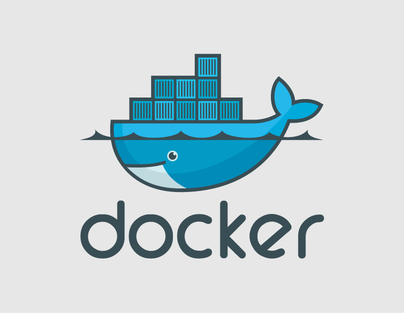
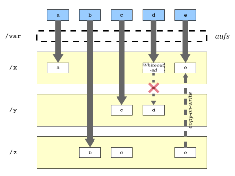

# Docker を使ってみた！
# LT風 - 2014/09/18

---

## 質問は随時歓迎です。ちょっとでも気になったら即質問で

---

## あ、マサカリ投げる（指摘、ツッコミする）場合は私がへこまない程度にお願いします

---

## 資料は後ほど展開するので、メモは頑張らないで大丈夫です

---

# 今日のゴール
# Docker の概要を理解して、興味を持ってもらう

---

# 目次

1. Docker ってなあに？
1. Docker の仕組み
1. Docker の利用方法
1. まとめ
 
---

# 目次

1. **Docker ってなあに？** ← これ
1. Docker の仕組み
1. Docker の利用方法
1. まとめ

---

# Docker ってなあに？

Docker は Web アプリケーション等を仮想化するための技術の１つです。Linux KVM や VirtualBox といった「ハイパーバイザ型の仮想化」に対して、「コンテナ型の仮想化」とも呼ばれています。




---

#  ( ´・∀・)ﾉ ハーィ
# さっそく質問いいですか

---

## Q. Docker とハイパーバイザ型って何が違うの？

---

## A. ハイパーバイザの代わりにDocker Engineを使用してます

---

## 図で見るとこんな感じ


---

## ゲストOS のエミュレートは不要！


---

#  ( ´・∀・)ﾉ ハーィ
# エミュレートが不要だと何がうれしいんですか？

---

## うれしいこと - その１

1. ハイパーバイザ型の場合はゲストOSをエミュレートして、その上でプロセスが動いているのに対し、Docker Engine は各プロセスをグループで隔離しているだけで、**プロセス自体は直接ホストOS上で動かしている**ためオーバーヘッドが小さい。ようするに少ないリソースで仮想化が実現できる（**超大事**）。


---

## うれしいこと - その2

2.オーバーヘッドが少ない分、ハイパーバイザ型と比べて起動が比較にならないほど速い！処理も速い！もう体感では物理サーバで動かしているのと変わらないくらい速い！


---

#  ( ´・∀・)ﾉ ハーィ
# その1.について質問です

---

## Q. 少ないリソースで仮想化実現できるのがそんなにうれしいんですか？

---

# A. そんなにうれしいんです！

---


## 単純にサーバに負荷がかからないためということだけでなく、クラウド視点からすると「負荷増=コスト増」となるため、負荷はお金と直結しています。負荷が減ってお金減らせたらうれしいじゃん！

---


---


#  ( ´・∀・)ﾉ ハーィ
# その2.について質問です


---

## Q. 体感で速いとかいわれても分からないよ。実際どれくらい速いんですか？見える化してよ

---

## A. 速さを比較している表があったので貼付けてみます
### 参考：軽くて使いやすい仮想化技術 「Docker」の仕組みとエンタープライズ開発における4つの活用事例 (http://codezine.jp/article/detail/7894)


---
##    .


---

## 数値で比較しても物理サーバと違いが見られない！ようするに、


---

## ハイパーバイザ型は
## 速さが足りない


---

## これはもう仮想化は
# コンテナ型を
## 使うしか無いでしょ


---

## ここで、Docker 以外にもコンテナを実装しているものがあるので幾つかご紹介

- LXC
Linuxのコンテナ化ソフトウェア。Docker 0.8 まではLXCを利用してコンテナ化を行っていたが、Docker 0.9 より libcontainer をベースとしたドライバがビルドインされ、このドライバによってコンテナ化を行うようになった。このため0.9以降では LXCは必須ではなくなった（0.9 以降もLXCドライバを利用してコンテナ化することは可能）。

--- 
- OpenVZ
RHEL(Red Hat Enterprise Linux) 用のコンテナ実装。Kernel に手を入れているため、公式にはRHELのみのサポートとなっている。また、ライブマイグレーションに対応している（この機能は Docker には存在していないのでライブマイグレーションを使いたい場合はOpenVZを利用）
- Warden
元々VMwareがCloud Foundry向けに開発したLinux向けコンテナ技術。現在この Warden を活用し、Dockerのlibcontainerプロジェクトの強化を行っている。


---

## ちなみに

---

## すでにGoogleは全部のソフトウェアをコンテナに乗せており、毎週20億個ものコンテナを起動しているらしいです。

---

## 実績もあるので、コンテナ化は今後もっと使われそうなイメージです。
## また、コンテナ化に関しては今 Docker が勢いがあるため、とりあえずコンテナ化したい場合は Docker を選ぶのが良いかと思います。

---


# ということで、Docker の仕組み


---

# 目次

1. Docker ってなあに？
1. **Docker の仕組み** ← これ
1. Docker の利用方法
1. まとめ

---


# Docker は既存技術を組み合わせているだけです

---

# 主な技術

- Go言語：Docker は Go 言語で記述されています
- User Namespace：名前空間によるプロセス、ネットワークの独立化（この技術でコンテナ化を実現）
- cgroups：リソース(CPU、メモリ、ディスクI/Oなど)の制御
- AUFS：データを差分で管理するファイルシステム（Docker Image を差分で管理するために使用）

---


# 補足_1 User Namespace

- User Namespace は Kernel 3.8 以降で実装された比較的新しい技術です（Ubuntuでいうと Version 12.04 くらい）。このため Docker を使用するためにはホストOS の Kernel が 3.8 以降である必要があります。

---

# 補足_2 AUFS

- AUFS は聞き慣れないファイルシステムかと思いますが、CD Boot で Linuxを起動した際に( KNOPPIX とか)、あたかもファイルを書き換えてるかのように動かせていたのは、この AUFS を利用していたためです。
⇒ 具体的にいうと〜

---

- システム関連のファイルを書き換えようとしても、光学ディスクに書き込まれているため、物理的にファイルの内容を書き換えることができません。そこで、変更があった内容についてはメモリー上に保存しておき、差分として管理しています。図で見るとこんな感じ

---



---

また、Docker がコンテナ化するときは、コピーオンライト（原本をそのまま参照させておき、変更した際に初めて複製する）を行っているため、同一のイメージを複数仮想化させた際に無駄なリソースをとらないで済みます

---

## 具体的うれしいこととしては
- 1GBのイメージを 10台立ち上げたとしても必要とするストレージは1GBで良い（ハイパーバイザ型の場合は10GB必要となる）ためストレージを節約できる
- 同様の理由でメモリも無駄なリソースを食わないため節約できる
- メモリ上にキャッシュされているため高速でデプロイできる

---


# 仕組みは以上
# 次はお待ちかね？の利用方法（デモもあるよ）

---

# 目次

1. Docker ってなあに？
1. Docker の仕組み
1. **Docker の利用方法** ← これ
1. まとめ

---

# Docker の利用方法

1. Docker をインストール(apt-get や yum)
1. Dockerfile を作成
1. Docker build コマンドで Docker Image を作成
1. Docker run コマンドで Docker Image をコンテナとして起動
※ Docker stopでコンテナを停止。start でコンテナを再度起動できます

---

# [fit] 簡単。

---

## ただ、Docker をインストールする際は注意点が

## 繰り返しますが kernel は 3.8 以上である必要があります。よく使われてそうな CentOS を調べてみると・・・

---

# あ、


---

# ６系全滅だ(3.x ですらない・・)


---

## 一応 Kernel version を上げることで使えますが、可能であれば 7 系使いましょう(サポート期間も6系より長い 2020年11月30日 ⇒ 2024年6月30日)。

---

## また、 Docker 開発チームはホストOSとしては、Ubuntu を推奨しています。これは、Docker が Ubuntu 上で開発されているためです。このため、OSが選べるのであれば Ubuntu を使うのが良いように思います。

---

## 補足として、ローカル環境で Docker を動かしたい場合は boot2docker といった Docker 用の軽量なディストリビューションを利用することをおすすめします。VirtualBox 上で動かします（後ほどデモでます）。

---

## Docker の利用方法にもどります(以下はさっきと同じです)
1. Docker をインストール(apt-get や yum)
1. Dockerfile を作成
1. Docker build コマンドで Docker Image を作成
1. Docker run コマンドで Docker Image をコンテナとして起動
※ Docker stopでコンテナを停止。start でコンテナを再度起動できます
ただし、

---

## さっくり説明していきます

---

# 1. Docker をインストール

---


## ごめんなさい、ここ見てください
- https://docs.docker.com/installation/#installation

## 各プラットフォームに対して丁寧に解説がされています（ムービー付きのものも！）

---

## 一応例として Ubuntu 14.04 ではこんな感じです。


```sh
$ sudo apt-get update
$ sudo apt-get install docker.io
$ sudo ln -sf /usr/bin/docker.io /usr/local/bin/docker
$ sudo sed -i '$acomplete -F _docker docker' /etc/bash_completion.d/docker.io
```

---


# 2. Dockerfile を作成

---

## Dockerfile とは

- Dockerfile は、プログラムのビルドでよく利用される make ツールの Makefile ファイルと同様に、Docker コンテナーの構成内容をまとめて記述するシンプルなテキスト形式のファイルです。Dockerfile があればどの環境でも同様な環境を容易に構築することができます。

---

## Dockerfile の書き方
- 1行につき1つの操作を｛命令｝と｛引数｝でスペース区切りで記述します。「#」から始まる行はコメントとして処理されます。DockerImageを作成する「docker build」コマンドでは、「Dockerfile」ファイルの上から順番に処理が実行されます。


```sh
＃ コメント
｛命令｝ ｛引数｝
```

---
## Dockerfile 命令概要

- FROM：元となるDockerイメージの指定
- MAINTAINER ：作成者の情報
- RUN：コマンドの実行
- ADD：ファイル／ディレクトリの追加
- CMD：コンテナーの実行コマンド 1
- ENTRYPOINT：コンテナーの実行コマンド 2
- WORKDIR：作業ディレクトリの指定

---

- ENV：環境変数の指定
- USER：実行ユーザーの指定
- EXPOSE：ポートのエクスポート
- VOLUME：ボリュームのマウント

---

## Dockerfile のシンプルな例


1. FROM 命令でベースとなるイメージ（OS等）を指定
1. RUN 命令で任意のコマンドを実行（apt-get 等）し、その結果を作成するイメージにコミットする
1. CMD 命令で実行するプログラムを指定

---

# nginx を例に Dockerfileを作成

```
# まずは FROMでベースとなるOSを指定
FROM ubuntu
# RUN で nginx をインストール
RUN apt-get update && apt-get install -y nginx
# 再度 RUN で index.html を作成
RUN echo "piyopiyo" > /usr/share/nginx/html/index.html
# CMD でnginx をバックグラウンドで起動
CMD /usr/sbin/nginx -g 'daemon off;' -c /etc/nginx/nginx.conf

```

---

# ということで実際に動かしてみましょう(デモ)

---

## Dockerfile ですが、github 等で公開されています

- 先ほどの nginx であれば https://github.com/dockerfile/nginx/blob/master/Dockerfile より、もっと完成度の高いものを取得できます。

---

## Dockere Image も Docker Hub より取得することができます

- https://hub.docker.com/

---

## また、Docker Hub では Docker Image をリポジトリとして利用できます
## ようするに、作成したDocker Image を共有することができます。

---

## 使い方も簡単

- 共有したい Docker Image があったら
 1. Docker login 
 1. Docker push *[Docker Image]*

- 取得したい Docker Image があったら
 1. Docker pull *[Docker Image]*

---

# ということで実際に動かしてみましょう(デモ)

---


## デモ終わりましたが、追加で3点ほど説明させてください

---

# １点目
# Dockerfile と Docker Image

---

## Q. 結局どっちを使えばいいの？ そのまま使える Docker Image だけでいいのでは？

---


## A. 環境を作る側（例：インフラ担当者）は Dockerfile で環境を定義し、Docker Image を作成しておき。環境を利用する側（例：開発者）は単純に Docker Image を pull して利用するのがよいかと思います

---

## インフラ担当者は Dockerfile を用意しておくことで、一部環境を変更する必要があった場合にも Dockerfile の一部を書き換えるだけで対応可能になります

---

# ２点目
# コンテナ内の動的データの取り扱い

---

## コンテナの作成は、毎回 Docker Image を元に行われます。そのため、実行中に作成される動的なデータは、新しく作成されるコンテナには引き継がれません。

---

## このため、ログデータやDBデータ等の動的に作成されるデータを保存する場合は、何かしら対策しておく必要があります

---

## 対策例をあげると

- DB を Docker で動かす場合は、データ保存場所はコンテナ外にする
- アプリログを保存する場合は、AWS S3 等の外部ストレージに連携させる

---


# ３点目
# Immutable Infrastracture

---

# 聞いたことある or 知ってる人 
#  ( ´・∀・)ﾉ ハーィ

---

## Immutable Infrastructure とは 

不変なサーバー基盤のこと。具体的には、一度サーバーを構築したらその後はサーバーのソフトウェアに変更を加えないことを意味する。

通常、サーバーにはソフトウェア構成の変更がしばしば行われ、場合によってはそれがアプリケーションの安定稼働に大きな影響をもたらすことがある。また、アプリケーションがサーバーソフトウェアに変更を加え、サーバー環境が破壊されてしまうこともある。

---

しかしながら、Immutable Infrastructureの考え方では、サーバーのソフトウェア構成を一定に固定し、アプリケーションをDockerなどの仮想環境上で稼働させることで、ホストOS自体への変更を行わないようにして安定的にアプリケーションを稼働させる仕組みとなっている。

アプリケーションを稼働させる仮想環境自体はいつでも廃棄・生成可能な仕様とすることで、アプリケーションを環境による問題から解放して安定稼働させることが可能になる。

by wikipedia 先生

---

## 具体的になにがうれしいかというと

- ローカル環境で気軽にTry＆Errorしながら構築できる
- 環境ごとの差分を意識しなくてよい
- クリーンな環境で作業ができる
- デプロイ自体もあらかじめ確認できるため安全に行える

---

##  Docker は Immutable Infrastructure の概念にマッチしているので、その恩恵を得ることができます

---

## ガシガシ使って行きましょう

---

# 最後にDocker のメリット / デメリット含めてまとめ

---

# 目次

1. Docker ってなあに？
1. Docker の仕組み
1. Docker の利用方法
1. **まとめ** 　　　　　← これ

---

# Docker のメリット
- 速い！
- 効率よくリソースが使える
- ポータビリティ性が高い
Dockerfile や Docker Image を利用することで、どのサーバでも同じ環境を構築することができる
- 有名どころの会社がどんどん Docker 関係で集まってきている

---
# Docker 関係で集まっている例

- 米VMwareは2014/8/25、カリフォルニア州サンフランシスコで開催の年次カンファレンス「VMworld 2014」において、米Docker、米Google、米Pivotalとの提携を発表
- 米Googleは2014/7/10、「Docker」コンテナの管理ツール「Kubernetes」（リンク先はGitHub）のプロジェクトに米Microsoft、米Red Hat、米IBM、米Docker、米Mesosphere、米CoreOS、米SaltStackが参加したと発表した。

---

## なんかもうドリームプロジェクトな感じ


---

# Docker のデメリット
- コンテナ内のデータが保持されないため一手間必要な場合がある（もしくは Docker を利用すべきではない）。
- 複数のコンテナを管理するツールがまだ未成熟
本番で使用するにはまだ早い感じ
- Linux のプロセスを分けて仮想化しているため、Linux 以外のOSを仮想化させて動かす事はできません（もちろん Windows を仮想化することはできません）

---

## まとめ
## 現状としては開発環境で使ったり、今後くるであろう Docker の流れに備えておけると良いように思います

---

# おわり
# ご清聴ありがとうございました。

---


# 参考文献
- Docker 入門 - Immutable Infrastructure を実現する - (技術評論社)
- アプリ開発者もインフラ管理者も知っておきたいDockerの基礎知識 (http://www.atmarkit.co.jp/ait/articles/1405/16/news032.html)
- DockerをCentOS 7にインストールする方法 (http://blog.yuryu.jp/2014/07/docker-centos7.html)

---

- Dockerが利用しているAUFSとLXC
http://shibayu36.hatenablog.com/entry/2013/12/30/173949
- CentOS で aufs (another unionfs) を使う
http://d.hatena.ne.jp/dayflower/20080714/1216010519
- Docker基礎+docker0.9, 0.10概要
http://www.slideshare.net/mainya/dockerdocker09-010
- コンテナ型仮想化「Docker 0.9」リリース。LXCに依存しなくなり、安定性向上など
http://www.publickey1.jp/blog/14/docker_09lxc.html

---

- Docker 0.9リリースドキュメント日本語訳: Execution driversとlibcontainer導入
http://d.hatena.ne.jp/mainyaa/20140311/p1
- PaaS基盤「Cloud Foundry V2」内部で使われるBuildpack、Wardenコンテナの仕組みとは？
http://www.publickey1.jp/blog/14/paascloud_foundry_v2buildpackwarden_1.html

---

- VMware、Docker、Google、Pivotalと協業し、企業向けコンテナ技術の導入を簡素化
http://www.vmware.com/jp/company/news/releases/vmw-Docker-Google-Pivotal-082514

